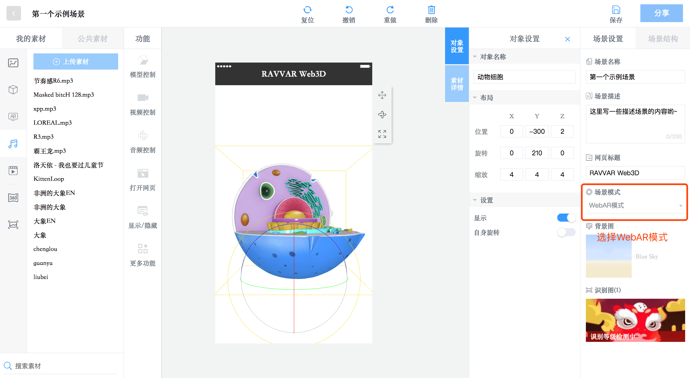

# RAVVAR WebAR/3D创意制作平台教程
# 一、注册RAVVAR帐号
## 1.1帐号注册
登录【[RAVVAR - AR （增强现实）自主创作](https://www.ravvar.cn)】点击右上角“制作AR”按钮开始注册帐号。
## 1.2WebAR/3D在线编辑器内测申请
登录【[RAVVAR WebAR/3D创意制作平台内测申请](https://labs.darseek.com/apply)】申请。

# 二、WebAR/3D在线编辑器介绍
## 2.1概述
- - - -


- - - -
## 2.2编辑器介绍
### 2.2.1新建WebAR/3D项目
- - - -

- - - -

### 2.2.2新建WebAR/3D场景
- - - -

- - - -

- - - -

- - - -

- - - -
### 2.2.3WebAR/3D编辑器界面基础介绍
- - - -

- - - -

- - - -
### 2.2.4Web3D场景设置
- - - -

- - - -
### 2.2.5WebAR场景设置
- - - -

- - - -
## 2.3创建属于自己的第一个WebAR/3D场景
### 2.3.1示例效果展示
**Web3D场景**：扫描如下二维码直接体验
- - - -

- - - -
**WebAR场景**：扫描如下二维码后再扫描识别图体验，识别图为淳萃官网Banner，地址为：https://www.ultradoux.com.cn/
也可以直接获取识别图：https://github.com/yangfawen/yangfawen.github.io/tree/master/Samples/WebAR/Marker
- - - -


- - - -
### 2.3.2Web3D场景示例
**示例中所用到的资源：**背景音乐、带飞翔动画的凤凰模型
**资源地址：**
**效果描述：**打开场景自动循环播放背景音乐并且出现一只凤凰在天空中飞翔；
#### 设定背景图片
- - - -

- - - -
#### 上传模型并拖拽到场景中设置
- - - -

- - - -

- - - -

- - - -
#### 设定模型交互事件：自动循环播放模型动画
- - - -

- - - -
#### 上传音频并拖拽到场景中设置
- - - -

- - - -

- - - -
#### 设定音频交互事件：自动循环播放BGM
- - - -

- - - -
#### 场景基础设置
- - - -

- - - -
#### 分享设置
- - - -

- - - -
#### 模型的环境贴图设置
RAVVAR WebAR/3D采用了新一代渲染技术（PBR），这也意味着模型效果的好坏有很大程度取决于环境贴图是否合适，当前我们内置了9个环境贴图，您可以这样来切换：
```
将WebAR/3D的链接修改为如下：
https://cloud.ravvar.cn/web3d/?env=metal#!scene/11778
当前内置的环境贴图分别为：
white、black、bridge、metal、parkday、parkngiht、skybox、skybox2、space，缺省时为parkday

```
- - - -
### 2.3.3WebAR场景示例
**示例中所用到的资源：**刘昊然祝福语音、刘昊然祝福视频动画、按钮（再玩一次、立即购买）
**资源地址：**
**效果描述：**打开场景后，扫描淳萃官网Banner，播放刘昊然祝福视频动画与语音，语音播放完毕后，显示按钮“再玩一次”和“立即购买”，点击“再玩一次”便重新播放刘昊然祝福视频动画与语音，点击“立即购买”跳转到淳萃京东官方商城；
#### 同时上传多张识别图
- - - -

- - - -
#### 设定刘昊然祝福视频的自动播放
- - - -

- - - -
#### 设定刘昊然祝福音频的自动播放
- - - -

- - - -
#### 设定控制按钮
- - - -

- - - -
#### 立即购买按钮功能设定：点击立即购买按钮立即打开淳萃京东官方商城链接
- - - -

- - - -
#### 设置按钮交互：音频播放停止后显示按钮UI
- - - -


- - - -
#### 设置按钮交互：点击“再看一次”后隐藏按钮UI
- - - -

- - - -
#### 设置按钮交互：点击“再看一次”后播放刘昊然祝福视频和音频
- - - -

- - - -

